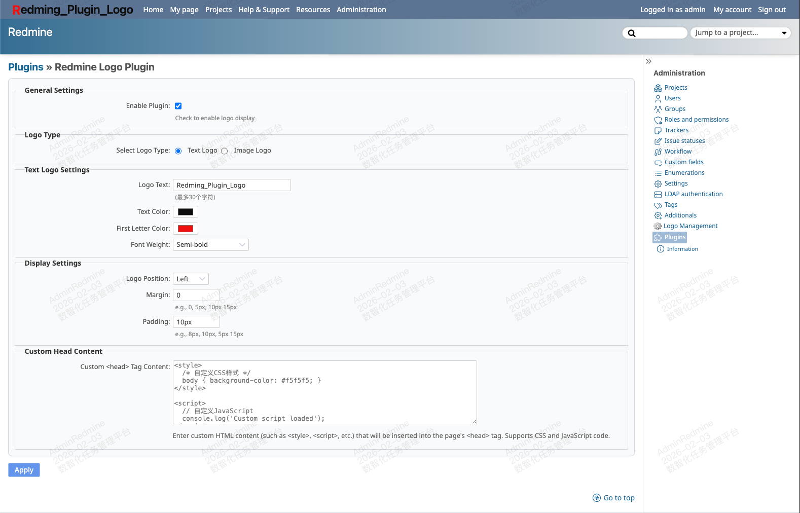

# Redmine Logo Plugin

A customizable logo plugin for Redmine 6.1.x with text/image logo support, flexible positioning, custom head content insertion, **system-wide URL override**, and comprehensive multi-language support.



## Features

### Logo Customization
- **Text & Image Logos**: Support for custom text logos (max 30 chars) and image uploads (JPG, PNG, GIF, SVG)
- **Flexible Positioning**: Left or center alignment with automatic spacing adjustment
- **Smart Text Styling**: 26px fixed size, first letter highlight, font weight options
- **AJAX Upload**: Real-time image upload with preview and status indicator
- **Custom Head Content**: Insert `<style>`/`<script>` tags (logged-in users only)
- **CSS Isolation**: All classes/IDs prefixed with `redmine_logo-` to prevent conflicts
- **Enable/Disable Toggle**: Switch logo display on/off without losing settings
- **Responsive Design**: Optimized for mobile devices

### System URL Override (New)
- **Global URL Replacement**: Replace default `http://localhost:3000` throughout Redmine
- **Email Integration**: All email notifications use custom URL
- **Plugin Compatibility**: Works with all plugins that use `home_url` or `url_for`
- **Protocol Detection**: Automatic http/https detection from custom URL
- **Independent Feature**: Completely separate from logo functionality

### Internationalization
- **29 Languages**: Full UI localization support
- **Right-to-Left**: Support for Arabic and Persian languages
- **Complete Coverage**: All UI elements translated

## Requirements

- Redmine 6.1.0 or higher
- Ruby 2.7+ (compatible with Redmine 6.1.x requirements)
- Rails 6.1+ (compatible with Redmine 6.1.x requirements)

## Installation

1. **Download the plugin**
   ```bash
   cd /path/to/redmine/plugins
   git clone https://github.com/carolcoral/redmine_logo.git redmine_logo
   ```

2. **Install dependencies**
   ```bash
   cd /path/to/redmine
   bundle install
   ```

3. **Run database migrations**
   ```bash
   RAILS_ENV=production bundle exec rake redmine:plugins:migrate
   ```

4. **Restart Redmine**
   ```bash
   # For Passenger + Apache
   touch tmp/restart.txt

   # For other setups, restart your application server
   ```

5. **Clear cache** (optional but recommended)
   ```bash
   RAILS_ENV=production bundle exec rake tmp:cache:clear
   ```

## Configuration

### Basic Logo Settings

1. **Access**: Login as Admin → **Administration → Logo Management** (or **Plugins → Redmine Logo Plugin → Configure**)

2. **Enable/Disable**: Toggle logo display on/off without losing settings

3. **System Access URL** (Optional): Set custom system URL to replace default `http://localhost:3000` (affects emails and all plugins)

4. **Logo Type**: Choose **Text** or **Image**

5. **Text Logo**: Enter text (≤30 chars), select colors, font weight, first letter highlight

6. **Image Logo**: Choose file → Click **Upload Picture** → Wait for preview → Save

7. **Display**: Set position (left/center), margin, and padding

8. **Custom Head** (Optional): Insert `<style>`/`<script>` tags (logged-in users only)

9. **Save**: Click **Save** to apply changes immediately

### System URL Override

The **System Access URL** field provides a powerful system-wide URL replacement feature:

- **What it does**: Replaces `http://localhost:3000` throughout Redmine (emails, plugins, generated URLs)
- **How to use**: Enter your full URL (e.g., `https://redmine.example.com` or `https://projects.mycompany.com/redmine`)
- **Verification**: Check email links or run `bundle exec rails runner "puts home_url"` in console
- **Leave empty**: To use Redmine's default configuration

**Example**: Set `https://redmine.example.com` → All email notifications will use this URL instead of `http://localhost:3000`

See [CUSTOM_SYSTEM_URL_README.md](CUSTOM_SYSTEM_URL_README.md) for detailed technical documentation.

## Usage Examples

**Text Logo**: "MyCompany" with orange first letter, white text, bold weight, left position

**Image Logo**: Upload logo → Click Upload → Preview → Save (max width: 120px)

**Custom Head**: Add analytics or custom CSS/JS (logged-in users only)

## File Structure

```
redmine_logo/
├── init.rb                                  # Plugin registration & settings
├── app/
│   ├── controllers/                         # Image upload handling
│   ├── helpers/                             # Logo rendering logic
│   └── views/
│       └── logo_settings/
│           └── _form.html.erb              # Configuration form (AJAX upload)
├── config/
│   ├── locales/                            # 29 language translations
│   │   ├── en.yml                          # English
│   │   ├── zh.yml                          # Simplified Chinese
│   │   ├── zh-TW.yml                       # Traditional Chinese
│   │   ├── de.yml                          # German
│   │   ├── fr.yml                          # French
│   │   ├── es.yml                          # Spanish
│   │   ├── ja.yml                          # Japanese
│   │   ├── ko.yml                          # Korean
│   │   ├── ar.yml                          # Arabic
│   │   ├── fa.yml                          # Persian
│   │   └── ... (20 more languages)
│   └── routes.rb                           # Plugin routes
├── db/migrate/                             # Database migration
├── lib/redmine_logo/
│   ├── system_url_override.rb             # System URL override logic
│   └── view_listener.rb                   # View hooks & CSS generation
├── screenshots/                           # Plugin screenshots
├── CUSTOM_SYSTEM_URL_README.md           # Technical documentation for URL override
└── README.md                             # This file
```

## Browser Compatibility

- ✅ Chrome 20+
- ✅ Firefox 29+
- ✅ Safari 12.1+
- ✅ Edge 18+
- ⚠️ IE11: Color picker will fall back to text input

## Troubleshooting

### Logo Issues

**Logo not displaying**
- Check enable status
- Clear browser cache (Ctrl+Shift+R)
- Verify settings saved correctly
- Check browser console for errors
- Verify file permissions on upload directory
- Restart Redmine service

**Image upload fails**
- Check browser console for JavaScript errors
- Verify folder permissions (should be writable by Redmine)
- Check image format (JPG, PNG, GIF, SVG supported)
- Review Redmine logs for server-side errors
- Ensure `custom_system_url` and other settings are preserved after upload

**Color picker not working**
- IE11 uses text input fallback (color picker not supported)
- Modern browsers (Chrome, Firefox, Safari, Edge) fully supported

**Mobile display issues**
- Plugin is responsive and auto-adjusts for mobile devices
- Test on multiple screen sizes (320px to 1024px)
- Verify font sizes are appropriate on small screens

### System URL Override Issues

**URL not changing after setting custom address**
1. Confirm saved in plugin settings (Admin → Logo Management)
2. Restart Redmine service (required for module loading)
3. Clear cache: `RAILS_ENV=production bundle exec rake tmp:cache:clear`
4. Verify in Rails console:
   ```bash
   bundle exec rails runner "puts Setting.host_name"
   bundle exec rails runner "puts Setting.protocol"
   bundle exec rails runner "puts home_url"
   ```
5. Check `config/locales/*.yml` files contain translations

**Email links still use old address**
- Emails sent before setting change will have old URLs
- New emails will use custom URL
- Verify email templates don't hardcode URLs
- Check `Setting.host_name` returns new address in console

**Other plugins not using custom URL**
- Most plugins use `home_url` or `url_for` and will work automatically
- Some plugins may cache URLs (restart may be needed)
- Verify plugin compatibility with Redmine 6.1.x

### General Issues

**Settings not preserved**
- Check browser JavaScript is enabled (required for AJAX upload)
- Verify all form fields are included in save request
- Clear browser cache and try again
- Check for JavaScript errors in browser console

**Translation missing**
- Plugin supports 29 languages
- If translation missing, check `config/locales/` directory
- Default to English if translation not available
- Consider contributing translations via GitHub

## License

This plugin is released under the MIT License.

## Credits

- **Author**: carolcoral
- **GitHub**: https://github.com/carolcoral/redmine_logo
- **Compatibility**: Redmine 6.1.x, 6.0.x, 5.x

## Contributing

We welcome contributions! Please feel free to submit pull requests or issues on our GitHub repository.

**Translation Contributions**: The plugin currently supports 29 languages. If you'd like to add a new language or improve existing translations, please submit a pull request with updates to the `config/locales/` directory.

**Bug Reports**: Please include:
- Redmine version
- Plugin version
- Steps to reproduce
- Expected vs actual behavior
- Any error messages or logs

## Support

For issues, questions, or contributions, please visit:
- GitHub Issues: https://github.com/carolcoral/redmine_logo/issues

## Changelog

### Version 1.0.4 (2026-02-04)
- **Fixed Universal Button Jitter**: Resolved page jitter affecting all menu buttons (not just "Overview" and "Activity")
- **Logo Insertion Optimization**: Improved JavaScript insertion logic with `requestAnimationFrame` to minimize layout reflow
- **Settings Preservation Fix**: Enhanced custom system URL preservation during image uploads
- **Live Logo Type Switching**: Logo now updates immediately when switching between text and image types (no page refresh required)
- **Image Preview Clear**: Switching to text logo now automatically clears the image preview
- **Enhanced User Experience**: Both logo type switching and preview management now work seamlessly in real-time

### Version 1.0.3 (2026-02-03)
- **System URL Override**: New feature to replace default `http://localhost:3000` globally (affects emails and all plugins)
- **29 Language Support**: Complete internationalization (English, Chinese, German, French, Spanish, Japanese, Korean, Arabic, Russian, and 20 more)
- **Bug Fixes**: 
  - Fixed Persian (fa.yml) translation missing for custom system URL
  - Fixed CSS page jitter on "Overview" and "Activity" menus (removed transform: scale())
  - Fixed custom system URL being cleared when uploading logo images
- **Settings Preservation**: All settings including custom system URL are now preserved during image uploads
- **UI Improvements**: Optimized mobile font sizes and removed layout-destabilizing CSS transforms

### Version 1.0.2 (2026-02-03)
- **Custom Head Content**: Insert `<style>`/`<script>` tags (logged-in users only)
- **CSS Namespace Isolation**: All classes/IDs use `redmine_logo-` prefix
- **Left Positioning**: Uses `position: relative` with `float: left`
- Enhanced security and styling isolation

### Version 1.0.1 (2026-02-03)
- Enable/disable toggle switch
- Text logo: First letter highlight, 30-char limit, fixed 26px size, font weight options
- Image logo: AJAX upload with real-time preview, upload button, max-width 120px
- Mobile optimizations and improved error handling

### Version 1.0.0 (2026-02-02)
- Initial release with text/image logos, positioning, color picker, and responsive design
